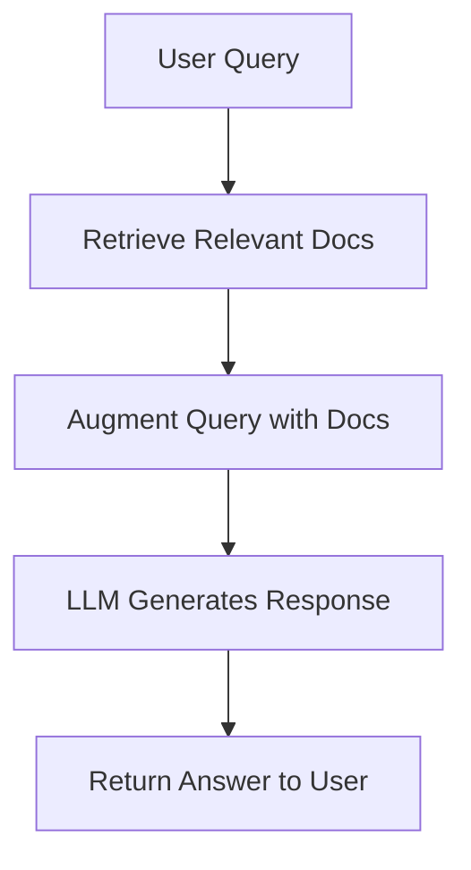

# RAG & LangChain in TravelAgent Project

## What is RAG (Retrieval-Augmented Generation)?
Retrieval-Augmented Generation (RAG) is an AI technique that combines information retrieval with generative models. Instead of relying solely on a language model's internal knowledge, RAG retrieves relevant documents or data from external sources and uses them to generate more accurate and context-aware responses.

**Key Steps in RAG:**
1. **Retrieve:** Search a knowledge base or database for relevant information based on the user's query.
2. **Augment:** Pass the retrieved information along with the query to a language model.
3. **Generate:** The language model generates a response using both the query and the retrieved context.

## What is LangChain?
LangChain is a Python framework for developing applications powered by language models. It provides tools to:
- Connect language models to external data (documents, APIs, databases)
- Build chains and agents that can reason, retrieve, and act
- Integrate retrieval, memory, and tool use into LLM-powered apps

## How RAG & LangChain Work in This Project

### 1. Data Storage & Retrieval
- The project uses a **vector database** (see `vector_db/`) to store document embeddings (numerical representations of text).
- When a user asks a question, the system retrieves the most relevant documents from the vector database using similarity search.

### 2. RAG Pipeline
- The RAG logic is implemented in `src/rag/pipeline.py`.
- The pipeline:
  - Receives a user query
  - Retrieves relevant documents from the vector store
  - Passes both the query and retrieved context to the language model
  - Generates a response that is grounded in the retrieved information

### 3. LangChain Integration
- LangChain is used to:
  - Manage the retrieval process (connecting to the vector DB)
  - Chain together retrieval and generation steps
  - Optionally, orchestrate more complex workflows (e.g., using tools, agents)

### 4. Example Workflow
1. **User Query:** "What are the top attractions in Paris?"
2. **Retrieve:** The system searches the vector DB for documents about Paris attractions.
3. **Augment:** The retrieved info is combined with the query.
4. **Generate:** The language model produces a detailed answer, citing the retrieved data.

### 5. Relevant Files in This Project
- `src/rag/pipeline.py`: Main RAG logic
- `vector_db/`: Vector database storage
- `src/agents/`, `src/tools/`: Additional logic for agents and tools

## Diagram

## Summary
- **RAG** improves answer quality by grounding LLMs in real data.
- **LangChain** makes it easy to build RAG pipelines and connect LLMs to external sources.
- This project uses both to provide accurate, context-aware travel information.

---

*Generated on February 19, 2026*